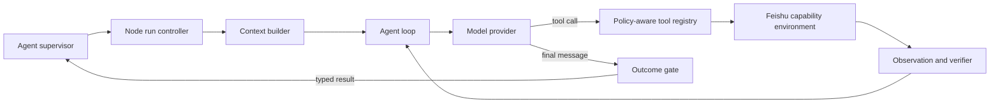

# Codex2Lark Agent Harness

## 1. Purpose

This document defines the small execution loop for one Agent node. Codex2Lark is
not only an MCP wrapper or message bot: the product combines this node Harness,
the durable multi-Agent supervisor, trusted capability plugins, and the live
Feishu environment. The supervisor and graph protocol are specified separately
in [multi-agent-runtime.md](multi-agent-runtime.md).

This design follows three proven ideas:

- [Harness Engineering](https://openai.com/index/harness-engineering/): humans
  define intent, a legible environment, invariants, and feedback loops; Agents
  execute inside them.
- [Codex Core and App Server](https://github.com/openai/codex/blob/main/codex-rs/app-server/README.md):
  one Harness powers many clients and owns threads, turns, tools, policy, and
  context instead of duplicating the loop in each UI.
- [Pi SDK](https://github.com/badlogic/pi-mono/blob/main/packages/coding-agent/docs/sdk.md):
  a small provider-neutral loop separates application messages from model
  messages, exposes typed tool hooks and lifecycle events, and keeps sessions,
  resources, extensions, and interfaces replaceable.

## 2. Harness boundary



The Harness owns:

- Agent and policy version selection;
- session and run identity;
- context assembly and progressive disclosure;
- model selection and inference;
- tool discovery, validation, authorization, execution, and observation;
- approvals and human steering;
- context budget and compaction;
- retry and cancellation boundaries;
- outcome verification and termination;
- structured lifecycle events, metrics, and redacted traces.

The Harness does not own:

- Agent graph topology, worker scheduling, or inter-Agent mailboxes;
- Feishu business-content ownership or retention policy;
- transport-specific webhook parsing;
- broker durability;
- raw credentials;
- arbitrary shell or OpenAPI execution;
- the UI used to observe a run.

## 3. Core abstractions

### V3 Runtime API 1 value contract

The first implementation uses immutable typed values at every Harness boundary:

```text
ModelRequest    run/node identity, ordered ModelMessage[], ToolDefinition[], budget snapshot
ModelResponse   assistant text, zero or more ToolCall values, usage, provider response ID
ToolCall        call ID, semantic tool ID/version, strict object arguments
ToolResult      call ID, typed observation, error category, effect class, verification
RunEvent        run ID, monotonic sequence, event type, encrypted typed payload, source time
Checkpoint      run ID, definition/resource versions, next turn, messages, verified effects,
                blockers, source versions, budget snapshot, compactor version
AgentOutcome    terminal state, user-visible summary, verified resource references, warnings
```

Model providers never execute tools. Tools never decide the terminal run state.
The Harness validates and sequences both.

### AgentDefinition

A versioned immutable definition loaded at run start:

```text
agent_id
version
instructions_ref
resource_manifest
allowed_tool_profiles
model_policy
context_policy
approval_policy
verification_policy
retention_policy
eval_suite_version
```

The Runtime API 1 definition also contains hard maximum turns, context tokens,
tool calls, external writes, wall time, and cost, plus a declared model profile,
tool allowlist, required resource packages, and whether completion requires at
least one verified external effect.

A running turn never silently changes definition version. New events may use a
new version after rollout; an in-flight run remains reproducible against the
version it started with.

### AgentMessage

The Harness never sends raw Feishu event JSON directly to a model. Channel
adapters normalize events into application messages:

```text
UserMessage      sender, chat, thread, message reference, normalized content
SystemEvent      bot added/removed, member change, policy change
ToolObservation  typed tool result or typed failure
ApprovalRequest  proposed action, risk, target, expiry
ApprovalDecision approved/rejected by an authorized user
SteeringMessage  new instruction for an active run
FollowUpMessage  queued work after the active run
RunNotice        progress or operational status; normally filtered from model input
```

Following Pi's message transformation boundary:

```text
AgentMessage[]
  -> transform_context()
  -> policy_filter()
  -> ModelMessage[]
```

`SystemEvent`, `RunNotice`, routing identifiers, secrets, and operational
diagnostics do not automatically enter model context. The ContextBuilder
converts only explicitly supported fields.

### SessionKey

```text
tenant_key / app_id / chat_id / optional_thread_root_id
```

The key is selected by trusted routing code before the model runs. Message text
cannot change it. One SessionKey has one active run; different keys may run in
parallel.

### Run and Turn

A **root run** handles one accepted Feishu trigger or interactive request. A
**node run** handles one assignment within that root graph. A **turn** is one
model inference followed by zero or more tool executions. One node run may
contain many turns.

```text
Run
├── run_started
├── turn_started
├── model_output_delta*
├── tool_requested
├── approval_requested?
├── tool_started
├── tool_progress*
├── tool_completed | tool_failed
├── turn_completed
├── context_compacted?
└── run_completed | run_blocked | run_failed | run_cancelled
```

This event model is the stable integration boundary for Feishu cards, logs,
tests, and future UIs. Event observers cannot mutate Harness state directly.

## 4. Agent loop

```text
admit request
  -> load immutable AgentDefinition and group policy
  -> build bounded live context
  -> call model
  -> if tool calls:
       validate schema
       run before_tool policy and approval hook
       execute permitted tools
       convert results to bounded observations
       append observations
       verify side effects
       repeat
  -> if final response:
       evaluate outcome contract
       publish reply/result
       finish
  -> if budget, policy, approval, or verification blocks:
       emit explicit terminal state
```

The loop has hard limits for model turns, total tool calls, repeated identical
tool calls, context tokens, output bytes, wall time, Feishu requests, model
cost, and external writes. A final assistant message alone does not prove task
completion when the requested outcome includes an external write; the Outcome
Gate requires a verified resource or a truthful blocked/failed result.

Read-only tools may execute in parallel when they are independent. Mutations of
one Feishu resource execute sequentially. A mixed tool batch becomes sequential
when ordering or approval matters.

## 5. Context engineering

Codex2Lark gives the Agent a map, not an unbounded transcript.

Context layers have a stable order:

1. model-specific base instructions;
2. immutable AgentDefinition instructions;
3. safety, approval, identity, and retention policy;
4. stable ordered tool definitions;
5. progressively loaded Skill and reference material;
6. current tenant/group/thread environment metadata;
7. the triggering message;
8. bounded live Feishu context selected for the task;
9. observations produced during this run.

Resource loading is progressive. The root manifest describes available Skills,
document conventions, group policy, and tools. Detailed references are loaded
only when the task routes to them. Tool order and stable instruction prefixes
do not change mid-run unless a trusted policy event is appended explicitly.

### Source-backed context strategy

The ContextEngine selects from live Feishu and the authorized encrypted local
mirror. Freshness policy decides when a cached source version is sufficient and
when live refetch is mandatory. It:

- preserves speaker, time, message/thread relationships, and attachment type;
- includes image content only when the task requires vision and policy allows;
- represents file attachments by metadata unless explicit download is allowed;
- removes bot-generated loop messages and unsupported system noise;
- labels all content as untrusted data;
- enforces token and message-count budgets before model invocation.

### Compaction

Compaction is part of the Harness, not an ad hoc summary prompt. When a run
approaches its context threshold, it preserves:

- original user intent and acceptance criteria;
- authorized targets and identity;
- completed tool calls and verified outcomes;
- unresolved failures, approvals, and next actions;
- live resource URLs/tokens needed for continuation;
- recent messages and observations.

Compaction cuts at complete turn boundaries and never separates a tool call from
its result. It preserves the active request, acceptance criteria, verified
effects, unresolved blockers, source versions, and next action. It never turns
an unverified model claim into completion. A versioned checkpoint and lifecycle
event make reconstruction and eval comparison explicit.

## 6. Tool and environment model

Tools are semantic capabilities, not transport commands. Every tool definition
contains:

```text
name, description, strict input schema, result schema,
read/write/destructive/open-world annotations,
identity requirements, authorization resolver,
timeout, retry policy, idempotency policy,
verification policy, redaction policy
```

Tool execution passes through hooks inspired by Pi and Codex policy layers:

1. `before_tool_call`: validate arguments, bind tenant/chat/identity, check
   policy, classify risk, and request approval when necessary.
2. `execute`: call the shared Feishu capability through a typed port.
3. `after_tool_call`: redact and bound output, run read-back verification,
   attach provenance, and decide whether the outcome is terminal.

The model cannot supply `tenant_key`, credential references, or an arbitrary
target chat for event-originated runs. Trusted run context binds them outside
the model-visible schema.

## 7. Steering, follow-up, and approvals

If a new message arrives for an active SessionKey:

- a reply explicitly correcting or cancelling current work becomes a steering
  message;
- an independent request becomes a follow-up message;
- ordinary unaddressed chat remains in Feishu and is not injected mid-run.

Steering is applied only at safe boundaries: after a model response or completed
tool call, never halfway through an external write. Cancellation stops future
work but does not claim to roll back already verified Feishu side effects.

High-risk writes emit an approval card containing action, target, risk, and
expiry. Only an authorized group/user decision resumes the run. Approval state
is represented by a minimal run reference; secrets and document bodies are not
placed in the card or queue.

## 8. Session and recovery model

`SessionStore` is a port. Production uses an encrypted SQLite-backed journal and
checkpoint implementation; tests use an in-memory implementation of the same
contract. The durable store records user-visible normalized messages, typed
tool calls/results required for recovery, lifecycle events, budgets, and
structured checkpoints. It never records hidden reasoning or credentials.

After failure, the supervisor resumes from the last valid checkpoint, refetches
invalid or freshness-sensitive evidence, inspects uncertain external writes,
and re-enters the Agent loop. Stable operation keys and read-back verification
prevent blind replay. The storage and invalidation contract is defined in
[single-node-storage.md](single-node-storage.md).

Run creation, every lifecycle transition, every tool request/result, every
compaction, and terminal outcome append one monotonically sequenced event in the
same serialized store. A checkpoint is written only after a complete model turn
and all of that turn's tool results. Recovery rejects a checkpoint when its
AgentDefinition, resource package, policy, tool schema, source version, or
compactor version is incompatible.

## 9. Model provider boundary

The Harness uses a provider-neutral interface:

```text
stream(model_request) -> ModelEvent stream
compact(context, policy) -> compacted context
count_tokens(context) -> estimate
capabilities(model) -> tools, vision, structured output, limits
```

The first provider uses OpenAI Responses. Requests default to `store=false`.
Background mode, server-managed conversations, provider tracing with sensitive
payloads, and prompt-cache retention are independent policy switches whose data
behavior must be documented and accepted before enablement.

Model choice is policy, not group message input. A group may select among
administrator-approved profiles but cannot name an arbitrary endpoint or key.

## 10. Harness resources

Version-controlled Harness resources are the executable specification:

```text
harness/
├── agents/          AgentDefinition manifests
├── prompts/         stable instruction fragments
├── policies/        routing, tool, approval, identity, retention
├── skills/          progressive capability instructions
├── schemas/         AgentMessage, RunEvent, tool and outcome schemas
├── evals/           task fixtures and scored invariants
└── fixtures/        redacted Feishu event and tool-result contracts
```

`AGENTS.md` stays a concise map to authoritative documents and validation
commands. Architecture is enforced with schema tests, dependency rules, tool
contract tests, evals, and read-back verification rather than documentation
alone.

## 11. Evaluation and feedback loops

Every Harness change must run deterministic contract tests and a versioned eval
set covering:

- group routing and cross-group isolation;
- prompt injection in group messages and documents;
- tool selection and argument correctness;
- approval behavior and unauthorized writes;
- duplicate event redelivery and idempotency;
- context-window overflow and compaction;
- steering, cancellation, and follow-up ordering;
- bounded delegation, child context isolation, mailbox ordering, and merge;
- document quality and structural verification;
- truthful blocked/failure reporting;
- token, latency, external-call, and cost budgets.

Production feedback uses content-free metrics by default: run state, timings,
token counts, tool names, result categories, queue delay, retries, model/policy
version, and verification outcome. Capturing prompts, messages, documents, or
model outputs requires an explicit redacted evaluation environment and is never
the default telemetry path.

## 12. Completion contract

A run ends in exactly one terminal state:

- `completed`: requested observable outcome exists and required verification
  passed;
- `blocked`: specific approval, permission, ambiguity, or external dependency
  prevents safe progress;
- `failed`: retry budget ended or an invariant was violated;
- `cancelled`: authorized cancellation was observed at a safe boundary.

The final Feishu reply or interactive-client response includes the outcome,
affected resource links, concise change summary, verification state, and any
non-secret recovery action. It never claims success solely because the model
said it was done.
