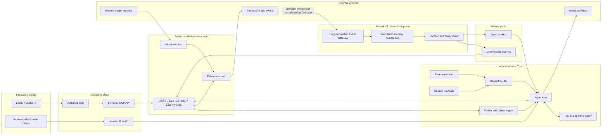

# Architecture

## 1. Architectural style

Codex2Lark V2 is a Harness-centered, event-driven Feishu Agent platform. One
versioned logical Agent can serve N Feishu groups without treating an
interactive Codex task or stdio MCP process as an always-on server.

- The **Agent Harness Core** owns the model/tool loop, context, policy,
  approvals, verification, compaction, recovery, and run events.
- The **interactive plane** lets Codex, ChatGPT, or another Agent actively call
  semantic Feishu capabilities through MCP.
- The **realtime plane** receives Feishu events through an independently
  deployed outbound long-connection Gateway and dispatches them through a
  bounded in-memory scheduler. Durable queues and Webhook ingress are optional
  adapters for deployments with stronger reliability or topology requirements.
- The **capability environment** implements Feishu Docs, Drive, IM, Whiteboard,
  Sheets, Base, notification, and verification once for both planes.

The Harness contract is defined in [agent-harness.md](agent-harness.md). The
research and rejected alternatives are recorded in
[multi-group-agent-architecture.md](research/multi-group-agent-architecture.md).



## 2. One Agent, many groups

"One Agent" means one immutable version of instructions, resources, tools,
guardrails, model policy, approvals, retention, and evals. It does not mean one
process or one shared model conversation. A pool of workers executes the same
AgentDefinition.

The stable isolation key is:

```text
tenant_key / app_id / chat_id / optional_thread_root_id
```

One key has at most one active run so messages and side effects remain ordered.
Different keys run concurrently. `sender_id` is an authorization and
attribution input, not the group context key.

The router rejects disabled groups, bot-authored loop messages, duplicate
side-effect requests, unsupported message types, and messages outside the
group's trigger policy. The default model trigger is an explicit `@bot` mention
or approved command. Deterministic system events do not invoke a model.

## 3. Component responsibilities

| Component | Lifetime | Responsibility | Business-content persistence |
|---|---|---|---|
| Agent Harness Core | Worker run | Build context, run model/tools, enforce policy, verify outcomes, compact, steer, and terminate truthfully | None by default |
| Feishu authoring Skill | Interactive/run resource | Teach document structure, artifact routing, edit policy, and verification | None |
| MCP API | Interactive host | Expose semantic Feishu tools to active Codex/ChatGPT clients | None |
| Harness Run API | Service | Start, stream, steer, approve, cancel, and inspect Harness runs | Content-free run metadata only |
| Event Gateway | Always on | Maintain and reconnect the Feishu long connection, validate envelopes, and publish minimal event references | None |
| In-memory TaskQueue | Gateway lifetime | Apply a hard capacity bound and decouple source reads from dispatch | None; contents disappear on process exit |
| Policy/session router | Always on | Resolve group policy, select workflow, assign partition, rate-limit, and prevent loops | None |
| Deterministic workers | Always on | Membership, permissions, enrollment, notifications, and fixed automations | None |
| Agent workers | Elastic | Execute the logical Agent Harness for independent sessions | None after run unless optional TTL checkpoint is enabled |
| Identity broker | Always on | Resolve bot or delegated-user credentials from approved providers | Credential references only |
| Shared capability core | Library | Implement semantic Feishu operations, compilation, and read-back verification | None |
| `Codex2Lark Control` Base | Feishu | Group enrollment, owner, policy, Agent profile, and desired automation | Feishu-owned configuration |
| Observability pipeline | Always on | Metrics and redacted traces keyed by event/run IDs | No prompts or business bodies |

## 4. Agent Harness Core

The Harness is independent of Feishu transport and model provider. It exposes a
typed run protocol and uses ports for Resources, Sessions, Models, Tools,
Policies, Approvals, and Observers.

### Core loop

```text
normalized AgentMessage
  -> admit and bind trusted session/identity/policy
  -> load immutable AgentDefinition and progressive resources
  -> assemble bounded live context
  -> model inference
  -> validate and authorize tool calls
  -> execute permitted capabilities
  -> append bounded observations and verify side effects
  -> repeat until verified completion, blocked, failed, or cancelled
```

The model does not determine its tenant, target chat, credentials, tool profile,
or write approval. Trusted routing and policy bind those values outside the
model-visible schema.

The Harness emits ordered events for run, turn, message, model delta, tool,
approval, compaction, verification, and terminal state. Feishu cards, MCP
clients, tests, and future UIs consume the same event stream without owning the
loop.

MCP remains a tool protocol. Thread creation, streaming, steering, follow-up,
approval, cancellation, and recovery use the Harness Run API rather than being
forced into MCP semantics. This follows Codex's separation between Core and App
Server while keeping the Pi-like Agent core small and embeddable.

## 5. Event ingress

### Default long-connection profile

V2 Lite runs `codex2lark gateway` as an independent, always-on process. It uses
the pinned lark-cli event adapter to establish an outbound WebSocket connection
to Feishu. The Gateway therefore needs outbound internet access but no public
IP, public domain, TLS termination, load balancer, or inbound firewall rule.

The source adapter:

1. starts only fixed, configured event subscriptions;
2. waits for the exact lark-cli ready marker before reporting healthy;
3. enforces a line-size limit and validates the JSON envelope;
4. extracts a minimal `EventReference`;
5. submits it to the bounded `TaskQueue` port;
6. reconnects with bounded backoff after an unexpected source exit;
7. performs no model call or slow Feishu read on the receive path.

The reference contains only applicable fields from:

```text
event_id, event_type, tenant_key, app_id, chat_id, message_id,
create_time, trace_id, delivery_attempt
```

The raw event body is not queued. Handlers refetch current group, document, and
member state from Feishu using trusted identifiers. One application-level long
connection serves all subscribed groups; `chat_id` routes group isolation, so N
groups do not require N connections.

### Optional ingress adapters

An authenticated HTTPS Webhook source may be added when a deployment needs a
public callback topology, serverless ingress, or platform constraints that do
not support long connections. It must emit the same `EventReference` and cannot
change handlers or queue semantics. It is not part of the default deployment.

## 6. Queue, routing, and ordering

The queue follows a port-and-adapter boundary:

```text
EventSource -> TaskQueue -> PartitionedDispatcher -> EventHandler
```

`TaskQueue` exposes only bounded publish/receive/completion behavior. The
default `InMemoryTaskQueue` uses `asyncio.Queue`; capacity is configuration with
a conservative default. Backpressure propagates to the source instead of
allowing unbounded memory growth.

The dispatcher uses a stable hash of `SessionKey` to assign references to a
fixed number of in-memory partitions. One coroutine processes each partition,
so events for one chat remain ordered while different partitions execute
concurrently. The handler performs bounded retry for transient failures and
reads live Feishu state before every side effect.

V2 Lite does not claim durable acceptance, replay after process exit, or
exactly-once delivery. The in-memory queue is deliberately lost with the
process. Docker or systemd restarts restore availability but cannot restore
accepted in-memory work.

When a deployment requires restart-safe accepted work, sustained backlog, or
multiple independent workers, it may supply a durable `TaskQueue` adapter such
as RabbitMQ or a managed queue. That adapter owns confirms, acknowledgements,
retry timing, TTL, and dead-letter policy. Event sources and handlers remain
unchanged. Even then, exactly once is not claimed.

Duplicate safety combines live read-before-write, upstream idempotency keys
where supported, stable operation keys derived from event/workflow/target,
short-lived deduplication metadata when necessary, and verification before ack.

## 7. Group control plane

Desired group behavior lives in a Feishu Base named `Codex2Lark Control`, not a
local configuration database. Each row identifies one
`tenant_key/app_id/chat_id` and may contain:

- live group name and enabled state;
- owner/current-user `open_id` and an opaque credential reference;
- AgentDefinition and policy version;
- trigger mode and allowed tool profile;
- write-approval level and administrators;
- managed Drive folder policy;
- rate-limit class and maintenance state;
- last content-free configuration verification status.

When a bot joins a group, a deterministic worker verifies the event, creates or
checks the control row, ensures the configured owner is a member, and sends an
onboarding card. Bot removal disables enrollment. Neither event calls a model.

Secrets never enter Base. They stay in lark-cli, an OS keychain, or an external
secret provider and are resolved by the Identity Broker.

## 8. Context and session model

Channel adapters convert raw payloads into `AgentMessage` objects. The Harness
then transforms application messages into model messages. System events,
routing identifiers, secrets, and operational notices are excluded unless an
explicit ContextBuilder rule renders safe information.

Stable context layers are:

1. model-specific base instructions;
2. AgentDefinition instructions;
3. safety, identity, approval, and retention policy;
4. stable ordered tool definitions;
5. progressively loaded Skills and references;
6. trusted group/thread environment;
7. triggering request and bounded live Feishu context;
8. observations from the active run.

The default `LiveFeishuSession` stores no copied chat history. It reconstructs a
bounded context window from Feishu for each run. An `InMemorySession` supports
tests. An optional encrypted short-TTL checkpoint backend may later support
long-running recovery, but is disabled by default and is not a business source
of truth.

If a Worker fails without checkpoints, the broker redelivers and the run starts
again from live Feishu. Stable operation keys and inspection prevent duplicate
side effects. Repeated model inference cost is the explicit default tradeoff for
not retaining run transcripts.

Compaction preserves intent, acceptance criteria, authorized targets, completed
and verified operations, unresolved blockers, live resource references, and
recent observations. It never turns an unverified model claim into completion.

## 9. Model provider boundary

Interactive Codex remains a supported MCP client. Production inbound work uses
a backend model provider through the Harness, initially OpenAI Responses or the
Agents SDK. The interface supports streaming, token estimation, compaction, and
capability discovery without coupling the Harness to one model vendor.

OpenAI requests default to `store=false`. Background mode, server-managed
conversations, sensitive tracing, and prompt-cache retention are independent
deployment choices whose data behavior must be documented and approved before
enablement. Model choice is an administrator policy, never arbitrary group
message input.

## 10. Shared Feishu capability environment

The compiler, verifier, Drive resolver, document service, artifact service,
notification service, digest service, and membership service sit behind typed
ports independent of transport and credential source.

Expected adapters are:

- `LarkCliAdapter` for local MCP development and delegated-user workflows;
- `FeishuOpenApiAdapter` for always-on services using bot or delegated-user
  credentials from the Identity Broker.

Neither MCP nor a Harness tool exposes an arbitrary shell, raw lark-cli argv,
or unbounded OpenAPI path. Existing authoring invariants remain:

- inspect live resources before editing;
- compile semantic requests into bounded operations;
- use expected revisions where available;
- read every write back;
- report verification separately from notification delivery;
- destroy request-local files on every exit path.

## 11. Data and retention model

### Durable business data

- Feishu Docs, Drive, Whiteboards, Sheets, Base, Wiki, groups, and messages;
- group configuration in `Codex2Lark Control`;
- credentials in approved credential providers;
- versioned code, AgentDefinitions, prompts, policies, schemas, Skills, and
  evals.

### Bounded operational metadata

- in-memory event references for the life of the Gateway process;
- in-memory delivery attempts and scheduling state;
- content-free metrics and redacted errors;
- optional externally retained delivery metadata only when a durable queue
  profile is explicitly enabled.

Operational metadata never becomes a business source of truth and is never
persisted in the developer's project or workstation.

### Ephemeral run data

- live Feishu snapshots and bounded model context;
- model input/output in memory;
- Document IR, block IDs, revisions, edit plans, XML, and diagram sources;
- selectively downloaded images and upload payloads.

Provider-side retention is a separate policy surface and must match the chosen
deployment profile.

## 12. Failure and consistency model

The existing typed failures remain, with additional categories:

- `routing_error`: no enabled group/Agent policy matches;
- `delivery_error`: queue admission or handler dispatch failed;
- `rate_limit_error`: app, tenant, group, or model budget is exhausted;
- `retry_exhausted`: the in-process retry budget ended;
- `policy_error`: trigger, identity, target, or tool is not authorized.

Partition isolation, per-key concurrency, circuit breakers, and per-app/tenant rate
limits keep one group from blocking another. Feishu is refetched before writes;
queued references are never treated as current business state.

While the Gateway remains alive, the system provides bounded admission,
per-SessionKey ordering, cross-partition concurrency, idempotent observable side
effects, truthful terminal states, and deterministic lifecycle automation when
the model provider is disabled. It does not promise task recovery after Gateway
exit or a model reply while the provider is unavailable.

## 13. Security boundaries

- Feishu callbacks are untrusted until authenticated and schema validated.
- Group messages, documents, cards, filenames, and links may contain prompt
  injection.
- The router, not the model, selects tenant, chat, identity, tools, and policy.
- Message text cannot change the SessionKey or credential reference.
- Credentials never enter prompts, logs, queues, Base fields, or MCP results.
- Every event and tool call carries trusted tenant/app/chat authorization.
- Bot-authored messages do not trigger the normal Agent path.
- Cross-group retrieval requires a separately authorized workflow that names
  source and destination and obtains any required approval.

## 14. Deployment profiles

| Profile | Components | Intended use |
|---|---|---|
| Local interactive | Codex + stdio MCP + lark-cli | Manual authoring; no event availability promise |
| V2 Lite default | One standalone long-connection Gateway with bounded memory queue and partitioned handlers | N groups in one organization with minimal operations |
| Durable single tenant | Gateway + optional durable `TaskQueue` adapter + worker replicas | Restart-safe accepted tasks or strict SLOs |
| Multi tenant | Tenant-aware Gateway/router, isolated credentials/policies, durable queue if required, elastic workers | Multiple Feishu tenants and Agent profiles |

Runtime health excludes Codex and stdio MCP. V2 Lite monitors connection state,
in-memory queue depth, partition lag, handler failures, and process restarts. A
durable profile additionally monitors its queue and worker leases. All profiles
use redacted run tracing, versioned Harness rollout, eval gates, and rollback.
