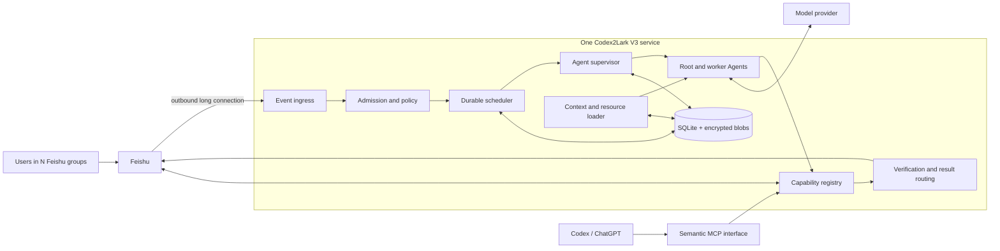
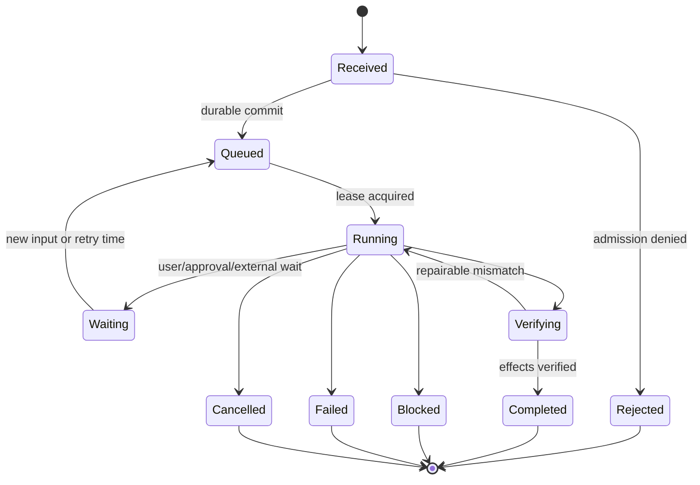
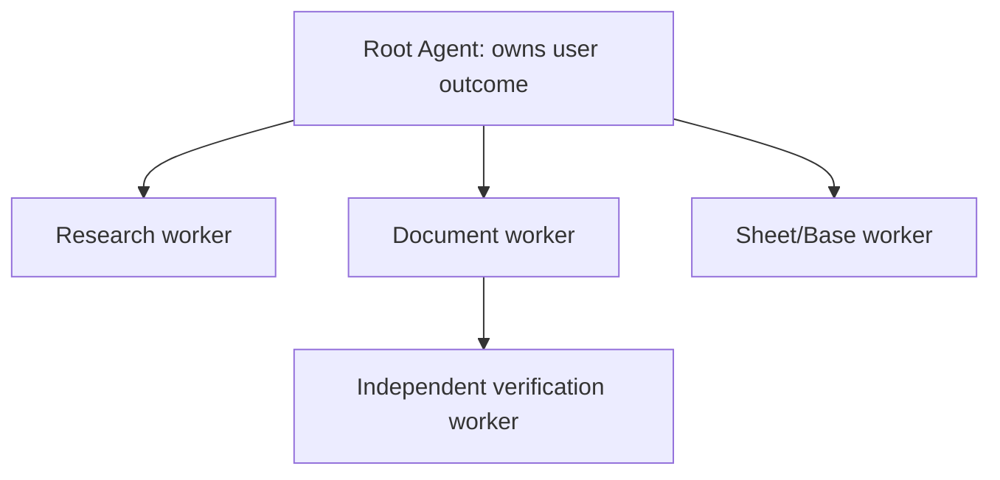

# Codex2Lark V3 architecture

## 1. Status and compatibility

This document is the normative target architecture for Codex2Lark V3. V3 is a
clean redesign. Existing Python modules, internal APIs, database-free behavior,
and Gateway scheduling contracts may be replaced. Compatibility with the V2
implementation is not a design constraint. Migration is required only for
operator configuration and business data explicitly selected for retention.

The V2 `realtime` package and its volatile queue/composition root are removed
once the V3 Gateway owns production event admission. The repository does not
ship two selectable group-runtime semantics. Historical research may describe
V2 decisions, but executable imports and operator commands resolve only to the
V3 durable composition root in `bootstrap.gateway`.

The production composition root owns construction, but depends on a narrow
authoring service bundle: document, artifact, and membership ports. Normal
startup constructs the trusted Feishu implementations. Contract and live-test
harnesses may inject another implementation of the same ports; this is a
composition boundary, not a model-visible plugin or arbitrary adapter surface.
All injected implementations remain subject to the same semantic-tool schemas,
policy gates, target locks, verification contract, and outbox terminal rules.

The `gateway` executable now uses the V3 durable kernel, service-native Feishu
IM transport, live context reconciliation, model Harness, bounded multi-Agent
delegation, semantic authoring capabilities, task worker, and outbox delivery
path. This document describes the normative target; it does not imply that
every target behavior is shipped. The authoritative implementation matrix and
open acceptance work are in [roadmap.md](roadmap.md). Current commands are
documented in [usage.md](usage.md).

## 2. Architectural decision

Codex2Lark is a single-node, multi-tenant **Feishu Agent Runtime**. It hosts
versioned Agent definitions and trusted Feishu capability plugins. One running
service supports many users, groups, threads, and concurrent tasks without
depending on an interactive Codex process.

The design combines three ideas:

- Harness Engineering: make repository rules, typed interfaces, verification,
  evaluation, and observability part of the product rather than relying on a
  clever prompt;
- Codex: represent work as isolated threads and turns, use a rooted Agent task
  graph, explicit inter-Agent communication, bounded concurrency, interruption,
  recovery, and terminal states;
- Pi: keep the Agent loop small, inject replaceable sessions and model/tool
  adapters, load resources progressively, emit lifecycle events, and compact
  context without breaking tool-call pairs.

Codex2Lark does not copy either product's unrestricted local-computer tool
surface. Feishu work uses typed semantic capabilities, trusted identity
bindings, explicit policy, idempotency, and live read-back verification.

## 3. Design principles

1. **Harness before prompt.** Policy, context selection, tool safety,
   verification, recovery, and evals are executable contracts.
2. **One task, one root Agent.** A Feishu request creates a durable task tree;
   the root owns the user outcome and may delegate bounded work.
3. **Isolation by trusted resource identity.** Tenant, app, chat, thread, user,
   credentials, and policy are bound outside model-visible input.
4. **Capabilities, not raw APIs.** Models receive semantic Feishu tools, never
   arbitrary shell, SQL, lark-cli arguments, or unrestricted OpenAPI paths.
5. **Durable coordination, bounded content.** SQLite persists task state,
   outbox intent, authorized message mirrors, checkpoints, and encrypted file
   data with retention.
6. **Feishu remains upstream truth.** Local data accelerates and recovers work;
   it never grants authority and is reconciled against Feishu.
7. **Truthful completion.** A task is complete only after observable effects
   pass verification. Sending a fluent reply is not completion evidence.
8. **Progressive disclosure.** Load only the instructions, evidence, tools, and
   sub-Agent context needed for the next decision.
9. **Single-node first.** SQLite and encrypted local blobs are sufficient for
   the selected deployment. RabbitMQ, Redis, PostgreSQL, and public Webhooks are
   not prerequisites.
10. **Replaceable internals.** Ports describe responsibilities; packages and
    implementations can be rewritten when evals and contracts remain valid.

## 4. System context



The long connection is initiated by Codex2Lark and requires outbound network
access, not a public IP. MCP is an independent interactive interface; it is not
the event service and its availability does not control inbound Feishu work.

The pinned Python Channel SDK captures a module-level WebSocket event loop when
it is first imported. The synchronous Gateway bootstrap must therefore create
the official Channel before `asyncio.run()` starts the Runtime loop, matching
the SDK's supported lifecycle. This compatibility rule is confined to the IM
transport adapter; the Runtime, plugins, Harness, storage, and model provider
never depend on SDK import order or private event-loop state.

## 5. Runtime decomposition

```text
RuntimeKernel
├── PluginManager
├── EventIngress
├── AdmissionController
├── DurableScheduler
├── AgentSupervisor
├── AgentHarness
├── ContextEngine
├── ResourceLoader
├── CapabilityRegistry
├── IdentityBroker
├── PolicyEngine
├── VerificationEngine
├── ResultRouter
├── StorageEngine
└── Observability
```

| Component | Single responsibility |
|---|---|
| PluginManager | Validate, initialize, health-check, drain, and stop trusted capability plugins |
| EventIngress | Maintain fixed Feishu subscriptions and normalize transport envelopes |
| AdmissionController | Bind source identity, Agent definition, policy, tools, budgets, and SessionKey |
| DurableScheduler | Lease recoverable commands with fairness, priority, backoff, and per-key ordering |
| AgentSupervisor | Own the rooted Agent graph, concurrency slots, cancellation, deadlines, and recovery |
| AgentHarness | Execute one Agent turn loop and emit typed lifecycle events |
| ContextEngine | Assemble bounded, attributed, injection-aware model input |
| ResourceLoader | Progressively load Skills, prompts, policies, response templates, and eval metadata |
| CapabilityRegistry | Expose versioned semantic tools contributed by plugins |
| IdentityBroker | Resolve bot or delegated-user credentials without exposing secrets to models |
| PolicyEngine | Authorize triggers, context, delegation, tools, writes, approvals, and data retention |
| VerificationEngine | Read external state back and decide verified, uncertain, or failed outcomes |
| ResultRouter | Publish acknowledgement, progress, approval, and one terminal result through an outbox |
| StorageEngine | Provide transactions, migrations, encryption, leases, retention, and backup primitives |
| Observability | Emit content-minimized traces, metrics, audit events, and eval evidence |

Domain behavior belongs to plugins. The kernel must not contain document block
syntax, IM post parsing, calendar recurrence, approval fields, or spreadsheet
formulas.

## 6. Execution model

### 6.1 Durable request lifecycle



Admission, task creation, acknowledgement intent, and source-event deduplication
commit atomically before the long-connection callback returns; no volatile
pre-admission queue sits between callback success and this commit. A worker
leases the task. On process restart, expired leases
return to the queue. External writes use stable operation keys and are inspected
before retry. Terminal reply intent commits with the terminal state and is sent
by the outbox worker.

### 6.2 Isolation and ordering

The trusted SessionKey is:

```text
tenant_key / app_id / chat_id / conversation_root
```

`conversation_root` is a thread root when present and otherwise a policy-defined
chat lane. One SessionKey has one active root run. Independent SessionKeys run
concurrently under global, tenant, app, group, model, and plugin limits. Sender
identity affects authorization and attribution, not conversation ownership.

Fair scheduling prevents one busy group from consuming all slots. The first
release uses weighted round-robin across tenant/group lanes, FIFO within a lane,
priority only for terminal delivery, cancellation, and deterministic safety
work.

## 7. Multi-Agent collaboration

Every admitted request creates one root Agent. The root may spawn worker Agents
only for concrete, independent work that fits its delegation policy. Agent nodes
form a rooted tree, never an unrestricted peer mesh.



Each node has its own context, tool allowlist, budget, deadline, lifecycle, and
mailbox. Children receive an explicit task brief plus the minimum selected
parent context. They do not inherit credentials, tools, full transcripts, or
authority implicitly. Only the root ResultRouter can publish the final user
outcome; children return typed artifacts and evidence to their parent.

The detailed graph, mailbox, merge, cancellation, and recovery contracts are in
[multi-agent-runtime.md](multi-agent-runtime.md).

## 8. Plugins and Feishu capabilities

The kernel loads trusted typed capability plugins. Initial plugins are:

- `feishu-im`: group events, messages, replies, threads, images, and files;
- `feishu-drive`: folders, search, metadata, permissions, and file transfer;
- `feishu-docs`: document inspection, compilation, editing, and verification;
- `feishu-sheets`: native sheets and structured data operations;
- `feishu-base`: Base schemas, fields, records, views, and verification;
- `feishu-whiteboard`: board creation, update, and rendered verification;
- `feishu-identity`: user, bot, chat membership, and credential resolution.

Cross-domain work is orchestrated by an Agent through semantic tools. Plugins do
not import one another's repositories or private adapters. Resource packages
contain declarative Skills, prompts, policy fragments, templates, and evals.
The complete contract is in [runtime-plugins.md](runtime-plugins.md).

## 9. Context and memory

Runtime memory has four explicit layers:

| Layer | Contents | Lifetime |
|---|---|---|
| Source evidence | Feishu messages, files, documents, and resource revisions with provenance | Policy TTL; reconciled |
| Run journal | User-visible inputs, typed tool calls/results, lifecycle, budgets, and verification | Recovery TTL |
| Working context | Selected instructions, evidence, observations, and recent complete turns | One active Agent node |
| Checkpoint | Structured intent, acceptance criteria, verified actions, artifacts, blockers, and next step | Recovery/continuation TTL |

Hidden reasoning is never persisted. Context is built from references, not by
concatenating an entire group history. Earlier messages and file content are
untrusted evidence. Stable policy and tool definitions form a cache-friendly
prefix; dynamic evidence follows. Compaction cuts at complete turn boundaries,
keeps tool calls with results, preserves active requirements and verified
effects, and records source versions so edits, recalls, deletions, or permission
loss invalidate derived memory.

Sub-Agents get task-scoped context packages. Parent summaries are evidence, not
authority. A child result contains claims plus source and verification records;
the root decides whether it satisfies the shared acceptance criteria.

## 10. Identity, authorization, and approval

Trusted admission binds:

```text
tenant + application + source resource + actor + execution identity
+ AgentDefinition version + plugin/tool profile + approval policy + retention
```

The model cannot change those bindings. Bot identity is preferred for service
automation. Delegated-user identity is used only when the operation requires it
and an approved credential exists. Credentials remain in lark-cli, an OS
keychain, environment secret, or external secret provider.

Read, write, destructive, cross-group, and delegated-user operations have
separate policy classes. Approval decisions are durable typed events associated
with the exact proposed operation; a general chat message is not approval.

## 11. Data and storage

The default production profile uses SQLite in WAL mode and an encrypted managed
blob directory outside the repository. It persists recoverable scheduling,
authorized IM mirrors, selected attachments, run journals, context checkpoints,
idempotency, and outbox state. Retention is explicit per data class and may be
disabled per chat.

Feishu is the upstream source of truth. Sensitive reads and all writes re-check
live authorization and freshness. Local tombstones prevent stale redelivery
from resurrecting recalled or deleted content. Details are normative in
[single-node-storage.md](single-node-storage.md).

## 12. External effects and verification

Every semantic write follows:

```text
plan -> authorize -> approve if required -> inspect -> execute
     -> read back -> verify invariants -> record evidence -> publish result
```

Verification is capability-specific and must inspect user-observable state. A
document worker checks title, parent folder, block structure, tables, diagrams,
and embedded artifact references. A message publisher checks the returned
message reference. Unverifiable success is `uncertain`, never silently
`completed`.

## 13. Failure containment

- Event sources are independently supervised. The Feishu long-connection
  adapter follows the server-authoritative reconnect interval/count delivered
  during the authenticated handshake; invalid timing values are bounded by the
  pinned transport library. Codex2Lark observes reconnect lifecycle events,
  marks ingress degraded and closes its admission-ready gate while disconnected,
  then restores readiness only after a confirmed reconnect. It does not run a
  competing reconnect loop around the same socket.
- Plugin health gates only Agent definitions that require that plugin.
- Agent node failure does not cancel siblings unless root policy selects
  fail-fast or the failed node is a declared dependency.
- Parent cancellation cascades to descendants and running tool calls.
- Deadlines and budgets are enforced outside the model.
- Retry classification distinguishes transport, rate-limit, authorization,
  policy, validation, conflict, and verification failures.
- Poison tasks become terminal with diagnostics; they do not loop forever.
- SQLite or encryption-key failure stops admission before event acknowledgement.
- Disk high-water policy stops downloads/backfills while preserving terminal
  replies, cleanup, and diagnostics.

The single machine remains one failure domain. This is accepted for V3; backup
and restore protect the database, encrypted blobs, schema manifest, and external
key.

## 14. Observability and evaluation

Every admitted event creates one opaque trace ID. The durable task lease exposes
that ID; the root run, Agent graph, node transitions, run/tool/verification
events, approval, and task-bound outbox records inherit it rather than creating
unrelated IDs. A trace lookup therefore follows metadata joins from event to
task, run, graph/node, run event/tool call, approval, and outbox without
decrypting payloads. Trace IDs grant no authority and are never model supplied.
Logs and metrics exclude message bodies, tool arguments, file contents, prompts,
secrets, document/resource content, upstream error text, and hidden reasoning.

Release gates include deterministic scenarios for:

- many groups and users with isolation and fair scheduling;
- duplicate events, restarts, expired leases, and outbox replay;
- concurrent Agent trees, bounded delegation, merge conflicts, and cancellation;
- prompt injection from chats, files, documents, and child results;
- tool authorization, approval, idempotency, and live verification;
- context selection, compaction, edit/recall invalidation, and retention;
- plugin failure, model outage, Feishu rate limits, and disk pressure;
- truthful acknowledgement, progress, completed, blocked, failed, and cancelled
  messages.

Harness, AgentDefinition, Skill, prompt, policy, tool-schema, compactor, or model
changes require eval comparison before rollout.

## 15. Deployment

V3 production is one long-running service plus its data directory and external
encryption key:

```text
systemd or container supervisor
└── codex2lark runtime
    ├── Feishu outbound long connections
    ├── durable scheduler and Agent workers
    ├── SQLite runtime.db
    └── encrypted blob store
```

The process starts in this order: synchronous configuration/key validation and
Channel construction, Runtime event-loop creation, storage integrity,
migrations, plugins, policies/Agent definitions, model-provider identity/model
probe, event-source connection and bot-identity probe, recovery, then readiness.
`ready` requires both live probes; a configured secret alone is not health.
Provider readiness uses a metadata-only model lookup and never creates a model
response or token charge. The model adapter remains provider-neutral through an
OpenAI-compatible endpoint, key, and model identifier. The checked-in local
deployment profile selects DeepSeek at `https://api.deepseek.com` with
`deepseek-v4-flash`; this is an operations choice, not a dependency from the
Harness or capability plugins. Shutdown stops admission, drains within a deadline,
checkpoints or releases leases, flushes outbox state, closes sources, checkpoints
SQLite, and exits.

RabbitMQ is reconsidered only for multiple hosts, independent worker scaling,
or a measured queue SLO that SQLite cannot meet. Webhook ingress is reconsidered
only when deployment topology requires inbound callbacks. Neither is hidden
behind an abstraction merely for hypothetical flexibility.

## 16. Normative document map

- [requirements.md](requirements.md): product behavior and acceptance criteria;
- [multi-agent-runtime.md](multi-agent-runtime.md): Agent graph and collaboration;
- [agent-harness.md](agent-harness.md): one-node Agent loop and run protocol;
- [runtime-plugins.md](runtime-plugins.md): plugin and resource contracts;
- [group-agent-runtime.md](group-agent-runtime.md): Feishu IM plugin behavior;
- [single-node-storage.md](single-node-storage.md): durability, encryption, and recovery;
- [design-decisions.md](design-decisions.md): accepted alternatives and revisit triggers;
- [roadmap.md](roadmap.md): implementation slices and exit gates.
