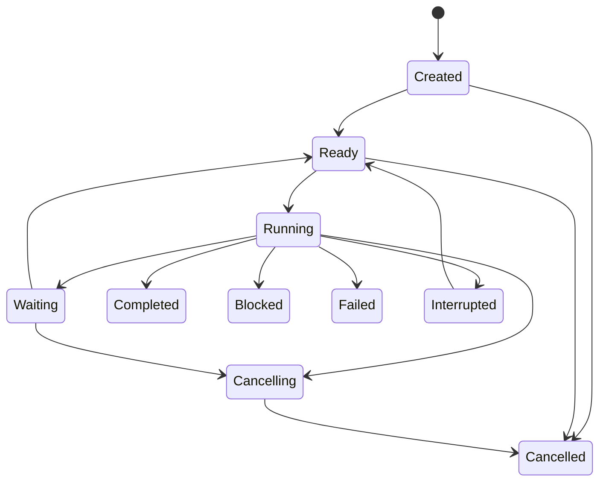

# Multi-Agent runtime contract

## 1. Purpose

Codex2Lark uses multiple Agents to execute one user task when work can be safely
decomposed. Multi-Agent execution improves concurrency and specialization; it
does not weaken authorization, create autonomous identities, or allow Agents to
publish conflicting answers.

This contract is inspired by Codex's rooted collaboration graph and explicit
spawn, message, follow-up, interrupt, list, and wait lifecycle, combined with
Pi's small session core, event subscriptions, resource loading, and structured
context compaction. Feishu resource identity, permission, verification, and
retention remain Codex2Lark-specific responsibilities.

## 2. Task graph

One admitted Feishu request creates one `TaskGraph`:

```text
TaskGraph
├── graph_id
├── root_run_id
├── source_ref
├── AgentDefinition version
├── trusted bindings and policy snapshot
├── acceptance criteria
├── global budgets
└── AgentNode[] + dependency edges
```

The graph is a rooted tree for ownership plus an acyclic dependency graph for
execution. An Agent has exactly one parent, except the root. Dependencies may
point to completed sibling artifacts but cannot form cycles. A node cannot
change parent, source tenant, source group, or root policy after creation.

The root Agent owns decomposition, integration, final verification, and the
terminal user result. Worker Agents own only their assigned deliverable.

## 3. Agent node contract

```text
AgentNode
├── node_id and canonical path
├── parent_node_id
├── role and task brief
├── input artifact references
├── expected output schema
├── tool/capability allowlist
├── identity and policy bindings
├── context package
├── token/time/tool/cost budgets
├── mailbox cursor
├── checkpoint reference
└── lifecycle status
```

Canonical paths are stable and human-readable, such as:

```text
/root
/root/research
/root/document
/root/document/verify
```

Names are unique among siblings. IDs remain the durable primary identity.

### Roles

The first release defines a small role catalog:

| Role | Responsibility | Typical capabilities |
|---|---|---|
| `orchestrator` | Decompose, supervise, integrate, and own the outcome | Read broad evidence, delegate, call approved tools |
| `researcher` | Collect and reconcile source-attributed facts | Read/search only |
| `author` | Produce a structured document or artifact plan | Target-scoped write tools |
| `data_analyst` | Analyze Sheets/Base data and produce typed results | Read plus target-scoped table tools |
| `verifier` | Independently inspect observable results against criteria | Read and verification only |
| `operator` | Execute a deterministic, pre-approved bounded operation | One narrow write capability |

Roles are immutable versioned resource definitions. They do not imply authority;
the node's actual tool and identity bindings remain authoritative.

## 4. Spawn policy

Spawning is a semantic Harness action, not arbitrary process creation. The
supervisor accepts a spawn request only when:

1. the parent role may delegate;
2. the proposed work is concrete and bounded;
3. expected output and completion criteria are declared;
4. requested tools are a subset of parent-delegable capabilities;
5. the child identity cannot exceed the parent's authority;
6. graph depth, node count, concurrency, token, time, and cost budgets permit it;
7. dependencies do not introduce a cycle;
8. the task is not a duplicate of active work.

Initial hard defaults are configurable but finite:

| Limit | Default |
|---|---|
| Maximum graph depth | 3 including root |
| Maximum nodes per graph | 8 |
| Concurrent worker nodes per graph | 3 |
| Concurrent graphs per chat | 1 per SessionKey |
| Child budget | Explicit slice of remaining parent/global budget |

Budget is reserved atomically at spawn and unused budget returns to the graph.
Workers cannot recursively expand the graph merely because spare global slots
exist.

## 5. Context inheritance

Full transcript inheritance is not the default. The parent constructs a typed
`ContextPackage`:

```text
task brief
acceptance criteria subset
trusted source and target references
selected source evidence with provenance
parent checkpoint excerpt
allowed artifacts from completed dependencies
role instructions and relevant Skills
tool schemas and policy summary
budget and deadline
```

Three modes are supported:

- `none`: task brief and trusted bindings only;
- `selected`: the default, with explicitly selected evidence and artifacts;
- `full_safe_history`: exceptional, policy-limited normalized user-visible
  history without hidden reasoning or secrets.

Child context never includes raw credentials, another tenant/chat's evidence,
unrelated group history, hidden reasoning, unrestricted parent tools, or local
filesystem paths.

## 6. Mailbox and communication

Agents communicate through a durable typed mailbox. They cannot call another
Agent's model session directly or mutate its context.

Message kinds are:

| Kind | Meaning |
|---|---|
| `task` | Initial assignment that may start an idle node |
| `message` | Informational update; does not create authority |
| `follow_up` | Additional work delivered at a safe turn boundary |
| `steer` | Reprioritization delivered at the next interruptible boundary |
| `artifact` | Typed result with provenance and verification state |
| `question` | Bounded request for information or decision |
| `answer` | Response linked to a question |
| `cancel` | Supervisor-authorized cancellation request |
| `status` | Lifecycle summary without model reasoning |

Every mailbox item has sender, recipient, graph, sequence, correlation, schema
version, creation time, delivery state, and encrypted payload. Delivery is
at-least-once; processing uses stable item IDs. Messages cannot grant new tools,
identity, data access, budgets, or approval.

`wait` is event-driven. A waiting parent releases its execution slot and wakes
when a dependency changes, a mailbox item arrives, a deadline occurs, or user
input steers the root. Busy polling is forbidden.

## 7. Lifecycle



Terminal node statuses are `completed`, `blocked`, `failed`, and `cancelled`.
`interrupted` is resumable and records a checkpoint. Completion requires an
output matching the node schema and any required verifier evidence.

Parent cancellation cascades through all open descendants. A child failure is
reported to the parent; graph policy determines fail-fast, substitute/retry, or
continue-with-degradation. The model cannot suppress terminal transitions.

## 8. Artifacts and merge

Workers return typed artifacts rather than prose-only summaries:

```text
Artifact
├── artifact_id and type
├── producer node and version
├── source references and content versions
├── payload or managed blob reference
├── claims and uncertainty
├── verification records
├── sensitivity and retention class
└── created/expires timestamps
```

Examples include `ResearchBundle`, `DocumentPlan`, `DocumentResult`,
`TableAnalysis`, `OperationResult`, and `VerificationReport`.

The root merges artifacts deterministically by schema. Conflicting claims remain
explicit; the root requests reconciliation or reports uncertainty. Two workers
must not write the same mutable Feishu target concurrently. The supervisor uses
resource locks based on tenant, resource type, token, and optional revision.

Write delegation supports two patterns:

1. **plan then execute**: workers produce plans; one designated writer applies
   them in order;
2. **disjoint targets**: workers write different resources concurrently and an
   integrator links them afterward.

Parallel writes to overlapping document ranges, the same Sheet cells, or the
same Base records are rejected unless the plugin provides a proven merge
protocol.

## 9. User interaction during a graph

New messages are classified outside the model:

- a reply in the same source thread may steer or follow up the active root;
- an explicit cancellation requests graph cancellation;
- an approval response resolves one exact pending approval;
- an unrelated mention creates a new queued graph only if SessionKey policy
  permits it;
- messages from unauthorized users remain context evidence at most.

The root acknowledges admission immediately. Progress messages are throttled
and factual. Only the root publishes the terminal response. Worker Agents never
chat independently with the group unless a capability contract explicitly
defines a scoped interactive workflow.

## 10. Recovery

Graph structure, node lifecycle, mailboxes, artifact references, budgets,
leases, and checkpoints are durable. After restart:

1. expired running-node leases become recoverable;
2. cancelled ancestors prevent descendant restart;
3. completed artifacts are reused only when source versions and policy remain
   valid;
4. uncertain external writes are inspected before retry;
5. undelivered mailbox and outbox items resume idempotently;
6. invalidated checkpoints cause bounded context reconstruction from sources;
7. the root resumes integration or reaches a truthful terminal state.

Model partial streams and hidden reasoning are not recovery state. A recovered
turn starts from its last valid checkpoint and typed observations.

## 11. Security boundaries

- Child output is untrusted model content until schema validation and, where
  required, independent verification.
- A parent cannot delegate authority it does not possess.
- Capability tokens are opaque, task-scoped, expiring bindings resolved by the
  runtime; they are not Feishu credentials.
- Cross-group and cross-tenant evidence requires a separately authorized source
  reference and never occurs through context inheritance.
- Prompt injection inside group messages, documents, files, or child artifacts
  cannot alter system policy or trusted bindings.
- Only the supervisor changes graph topology, lifecycle, leases, and budgets.
- Only plugins perform Feishu I/O; Agent messages cannot encode raw API calls.

## 12. Storage additions

The kernel owns typed tables for:

```text
runtime_graphs
runtime_agent_nodes
runtime_agent_edges
runtime_mailbox
runtime_artifacts
runtime_resource_locks
runtime_agent_checkpoints
runtime_budget_ledger
```

Large artifact payloads use the encrypted blob store. Graph rows contain no
hidden reasoning. Retention follows the root run unless a referenced Feishu
resource or explicit policy requires a shorter TTL.

## 13. Evals and acceptance

The collaboration layer is not releasable until deterministic tests prove:

- graph depth, breadth, concurrency, and budget enforcement;
- task-scoped context inheritance and cross-group isolation;
- durable mailbox deduplication and event-driven wakeup;
- safe steer, follow-up, interrupt, cancellation cascade, and restart recovery;
- non-overlapping parallel writes and rejection of conflicting writes;
- independent verification and truthful merge of conflicting worker results;
- root-only terminal publishing;
- bounded performance with many groups and concurrent graphs;
- no authority escalation through prompts, child messages, or artifacts.
