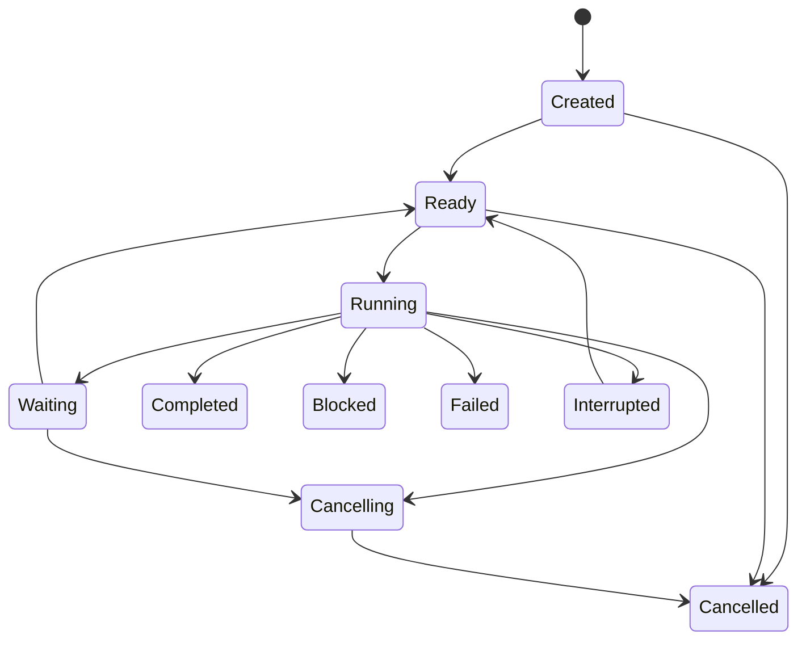

# Multi-Agent runtime contract

## 1. Purpose

Codex2Lark uses multiple Agents to execute one user task when work can be safely
decomposed. Multi-Agent execution improves concurrency and specialization; it
does not weaken authorization, create autonomous identities, or allow Agents to
publish conflicting answers.

This contract is inspired by Codex's rooted collaboration graph and explicit
spawn, message, follow-up, interrupt, list, and wait lifecycle, combined with
Pi's small session core, event subscriptions, resource loading, and structured
context compaction. Feishu resource identity, permission, verification, and
retention remain Codex2Lark-specific responsibilities.

## 2. Task graph

One admitted Feishu request creates one `TaskGraph`:

```text
TaskGraph
├── graph_id
├── root_run_id
├── source_ref
├── AgentDefinition version
├── trusted bindings and policy snapshot
├── acceptance criteria
├── global budgets
└── AgentNode[] + dependency edges
```

The graph is a rooted tree for ownership plus an acyclic dependency graph for
execution. An Agent has exactly one parent, except the root. Dependencies may
point to completed sibling artifacts but cannot form cycles. A node cannot
change parent, source tenant, source group, or root policy after creation.

The root Agent owns decomposition, integration, final verification, and the
terminal user result. Worker Agents own only their assigned deliverable.

## 3. Agent node contract

```text
AgentNode
├── node_id and canonical path
├── parent_node_id
├── role and task brief
├── input artifact references
├── expected output schema
├── tool/capability allowlist
├── identity and policy bindings
├── context package
├── token/time/tool/cost budgets
├── mailbox cursor
├── checkpoint reference
└── lifecycle status
```

Canonical paths are stable and human-readable, such as:

```text
/root
/root/research
/root/document
/root/document/verify
```

Names are unique among siblings. IDs remain the durable primary identity.

### Roles

The first release defines a small role catalog:

| Role | Responsibility | Typical capabilities |
|---|---|---|
| `orchestrator` | Decompose, supervise, integrate, and own the outcome | Read broad evidence, delegate, call approved tools |
| `researcher` | Collect and reconcile source-attributed facts | Read/search only |
| `author` | Produce a structured document or artifact plan | Target-scoped write tools |
| `data_analyst` | Analyze Sheets/Base data and produce typed results | Read plus target-scoped table tools |
| `verifier` | Independently inspect observable results against criteria | Read and verification only |
| `operator` | Execute a deterministic, pre-approved bounded operation | One narrow write capability |

Roles are immutable versioned resource definitions. They do not imply authority;
the node's actual tool and identity bindings remain authoritative.

## 4. Spawn policy

Spawning is a semantic Harness action, not arbitrary process creation. The
supervisor accepts a spawn request only when:

1. the parent role may delegate;
2. the proposed work is concrete and bounded;
3. expected output and completion criteria are declared;
4. requested tools are a subset of parent-delegable capabilities;
5. the child identity cannot exceed the parent's authority;
6. graph depth, node count, concurrency, token, time, and cost budgets permit it;
7. dependencies do not introduce a cycle;
8. the task is not a duplicate of active work.

Initial hard defaults are configurable but finite:

| Limit | Default |
|---|---|
| Maximum graph depth | 3 including root |
| Maximum nodes per graph | 8 |
| Concurrent worker nodes per graph | 3 |
| Concurrent graphs per chat | 1 per SessionKey |
| Child budget | Explicit slice of remaining parent/global budget |

Budget is reserved atomically at spawn and unused budget returns to the graph.
Workers cannot recursively expand the graph merely because spare global slots
exist.

### Runtime API 1 delegation tool

Every admitted mention prepares the durable root graph before the root Harness
starts. The root may call `agent.delegate` only when it has one concrete,
independent child deliverable. Its strict arguments are child name, approved
role, task brief, expected artifact type, and an explicit subset of the root's
tool IDs. Tenant/app/chat identity and the parent node are bound from
`ToolContext`, never model arguments.

The coordinator idempotently reuses the child canonical path, leases the child
through `MultiAgentSupervisor`, and runs a separate Harness session with the
child role instructions, smaller token/tool/write budgets, selected evidence,
and only the requested tool subset. The child returns a typed encrypted
artifact; its observable summary and verified resource references are supplied
to the root as a non-persistable tool observation. A worker cannot publish an IM
result. When the root Harness reaches a terminal state, the IM handler maps that
state to the graph terminal transition using the root node identity.

## 5. Context inheritance

Full transcript inheritance is not the default. The parent constructs a typed
`ContextPackage`:

```text
task brief
acceptance criteria subset
trusted source and target references
selected source evidence with provenance
parent checkpoint excerpt
allowed artifacts from completed dependencies
role instructions and relevant Skills
tool schemas and policy summary
budget and deadline
```

Three modes are supported:

- `none`: task brief and trusted bindings only;
- `selected`: the default, with explicitly selected evidence and artifacts;
- `full_safe_history`: exceptional, policy-limited normalized user-visible
  history without hidden reasoning or secrets.

Child context never includes raw credentials, another tenant/chat's evidence,
unrelated group history, hidden reasoning, unrestricted parent tools, or local
filesystem paths.

## 6. Mailbox and communication

Agents communicate through a durable typed mailbox. They cannot call another
Agent's model session directly or mutate its context.

Message kinds are:

| Kind | Meaning |
|---|---|
| `task` | Initial assignment that may start an idle node |
| `message` | Informational update; does not create authority |
| `follow_up` | Additional work delivered at a safe turn boundary |
| `steer` | Reprioritization delivered at the next interruptible boundary |
| `artifact` | Typed result with provenance and verification state |
| `question` | Bounded request for information or decision |
| `answer` | Response linked to a question |
| `cancel` | Supervisor-authorized cancellation request |
| `status` | Lifecycle summary without model reasoning |

Every mailbox item has sender, recipient, graph, sequence, correlation, schema
version, creation time, delivery state, and encrypted payload. Delivery is
at-least-once; processing uses stable item IDs. Messages cannot grant new tools,
identity, data access, budgets, or approval.

`wait` is event-driven. A waiting parent releases its execution slot and wakes
when a dependency changes, a mailbox item arrives, a deadline occurs, or user
input steers the root. Busy polling is forbidden.

## 7. Lifecycle



Terminal node statuses are `completed`, `blocked`, `failed`, and `cancelled`.
`interrupted` is resumable and records a checkpoint. Completion requires an
output matching the node schema and any required verifier evidence.

Parent cancellation cascades through all open descendants. A child failure is
reported to the parent; graph policy determines fail-fast, substitute/retry, or
continue-with-degradation. The model cannot suppress terminal transitions.

## 8. Artifacts and merge

Workers return typed artifacts rather than prose-only summaries:

```text
Artifact
├── artifact_id and type
├── producer node and version
├── source references and content versions
├── payload or managed blob reference
├── claims and uncertainty
├── verification records
├── sensitivity and retention class
└── created/expires timestamps
```

Examples include `ResearchBundle`, `DocumentPlan`, `DocumentResult`,
`TableAnalysis`, `OperationResult`, and `VerificationReport`.

Local artifact persistence follows the source contract, not the worker's prose.
Group-message/file-derived artifacts may be encrypted locally under the chat
retention policy because the operator explicitly enabled that mirror. Any child
with a Feishu Docs, Sheets, Base, Whiteboard, or Drive capability is treated as
potentially document-derived: its durable artifact stores only typed completion
status, verified resource references, warning codes, source versions, and
verification state. It never stores the child's generated summary, extracted
document text, table cells, or document-derived claims. A parent needing those
facts refetches the live Feishu resource through a read capability in its own
turn. This conservative rule applies even when a child did not actually call
the enabled document tool, avoiding provenance guesses after recovery.

The root merges artifacts deterministically by schema. Conflicting claims remain
explicit; the root requests reconciliation or reports uncertainty. Two workers
must not write the same mutable Feishu target concurrently. The supervisor uses
resource locks based on tenant, resource type, token, and optional revision.

Write delegation supports two patterns:

1. **plan then execute**: workers produce plans; one designated writer applies
   them in order;
2. **disjoint targets**: workers write different resources concurrently and an
   integrator links them afterward.

Parallel writes to overlapping document ranges, the same Sheet cells, or the
same Base records are rejected unless the plugin provides a proven merge
protocol.

`agent.delegate` is a read-classified orchestration capability and conditionally
parallel-safe. When one root model turn requests multiple independent, uniquely
named delegations, the Harness starts them concurrently only if every delegated
tool is read-only, or every writer declares at least one structured target that
has a registered capability resolver. Task prose is never a lock key.

Each declared target contains a writer `tool_id` and a capability-specific
resource reference. Before a writer node becomes `ready`, the runtime:

1. proves the tool is in the child allowlist and is write/destructive;
2. invokes that tool's read-only target resolver with the trusted tenant,
   identity, and policy binding;
3. obtains a canonical resource type, ID, and current revision from live
   Feishu state;
4. acquires the corresponding durable SQLite lock while the child remains in
   `created` state;
5. activates the child only after all declared locks succeed.

Resolution or lock failure cancels that child before it can run. A process crash
between spawn and activation leaves a durable `created` node; replay resolves
and locks it again before activation. The executor rebuilds each child's write
scope from its persisted owned locks. A scoped child write is denied unless the
tool resolves its actual arguments to one of those exact canonical targets, so
a child cannot declare one document and write another. Write tools without a
target resolver are never allowed inside a locked writer child.

The node durably records that write scope is mandatory; this policy is not
inferred from the current lock-row count. If its lock expires or is missing at
tool time, the executor rejects the write instead of treating an empty scope as
unrestricted. After resolving the actual live call target and revision, the
executor atomically proves ownership and renews the exact lock immediately
before the external write. Recovery must resolve, reacquire, and then reactivate
the node.

Existing-document edits resolve a canonical live token and revision. Creation
tools for managed-folder documents, workbooks, and Bases use capability-owned
logical reservations derived from resource type plus a SHA-256 digest of the
Unicode-normalized, case-folded title/name; raw titles are not stored in lock
rows. Whiteboard creation reserves its bound document/anchor, Sheet writes lock
the workbook, and Base upserts lock one Base/table pair. The tool independently
resolves its actual invocation arguments immediately before execution; a model
declaration that does not match the actual target is rejected. These
reservations serialize same-name creates and overlapping writes while allowing
disjoint resource work to run concurrently. A future capability without a
resolver remains serial. The graph supervisor still enforces budgets, leases,
and `max_concurrency`, and returned artifacts are placed into the root journal
in original call order.

The same lock boundary applies to root Agents, not only delegated writers. After
schema validation, policy evaluation, and any human approval, every root
write/destructive call must use the capability's trusted live-target resolver.
The executor then atomically maps the trusted `root_run_id` to its active graph
and root node, verifies the graph tenant equals `ToolContext.tenant_key`, and
acquires the same tenant/resource lock used by child Agents. Target resolution
and locking happen before idempotency recovery or any external mutation. A
missing resolver fails closed; an overlapping lock owned by another graph
returns a typed `write_target_busy` result and performs no write.

The root lease is held through reconciliation, execution, and read-back
verification, then only that exact target is released in a cancellation-safe
`finally` boundary. Process loss is covered by the finite durable lease. An
independent graph can therefore proceed after normal release or expiry, while
different canonical targets remain concurrent. Delegated writers continue to
hold their predeclared locks for the child lifecycle and the per-call executor
must not release them. A delegated child receiving any write/destructive tool
without a successfully resolved predeclared target is invalid and cannot be
activated.

## 9. User interaction during a graph

New messages are classified outside the model:

- a same-requester reply in the same source thread may steer or follow up the
  active root using the deterministic command grammar in
  [agent-harness.md](agent-harness.md#7-steering-follow-up-and-approvals);
- an explicit same-requester cancellation or interruption targets the active
  root graph and is observed at the next safe Harness boundary;
- an approval response resolves one exact pending approval;
- an unrelated mention creates a new queued graph only if SessionKey policy
  permits it;
- messages from unauthorized users remain context evidence at most.

Run controls are addressed by the trusted task/session binding, not a model-
supplied graph or node ID. The persisted control is encrypted and contains its
source message ID and actor binding. The root Harness is the only consumer;
children receive resulting scoped instructions only through supervisor-owned
mailboxes. Root cancellation cascades through the durable graph before the
terminal reply is published.

The root acknowledges admission immediately. Progress messages are throttled
and factual. Only the root publishes the terminal response. Worker Agents never
chat independently with the group unless a capability contract explicitly
defines a scoped interactive workflow.

## 10. Recovery

Graph structure, node lifecycle, mailboxes, artifact references, budgets,
leases, and checkpoints are durable. After restart:

1. expired running-node leases become recoverable;
2. cancelled ancestors prevent descendant restart;
3. completed artifacts are reused only when source versions and policy remain
   valid;
4. uncertain external writes are inspected before retry;
5. undelivered mailbox and outbox items resume idempotently;
6. invalidated checkpoints cause bounded context reconstruction from sources;
7. the root resumes integration or reaches a truthful terminal state.

Model partial streams and hidden reasoning are not recovery state. A recovered
turn starts from its last valid checkpoint and typed observations.

## 11. Security boundaries

- Child output is untrusted model content until schema validation and, where
  required, independent verification.
- A parent cannot delegate authority it does not possess.
- Capability tokens are opaque, task-scoped, expiring bindings resolved by the
  runtime; they are not Feishu credentials.
- Cross-group and cross-tenant evidence requires a separately authorized source
  reference and never occurs through context inheritance.
- Prompt injection inside group messages, documents, files, or child artifacts
  cannot alter system policy or trusted bindings.
- Only the supervisor changes graph topology, lifecycle, leases, and budgets.
- Only plugins perform Feishu I/O; Agent messages cannot encode raw API calls.

## 12. Storage additions

The kernel owns typed tables for:

```text
runtime_graphs
runtime_agent_nodes
runtime_agent_edges
runtime_mailbox
runtime_artifacts
runtime_resource_locks
runtime_agent_checkpoints
runtime_budget_ledger
```

Large artifact payloads use the encrypted blob store. Graph rows contain no
hidden reasoning. Retention follows the root run unless a referenced Feishu
resource or explicit policy requires a shorter TTL.

### Runtime API 1 transactional fields

The first implementation persists these typed identities and states:

```text
runtime_graphs
  graph_id, root_run_id, source tenant/app/resource, AgentDefinition,
  status, maximum depth/nodes/concurrency, created/updated

runtime_agent_nodes
  node_id, graph_id, parent_id, canonical path, name, role, task brief,
  expected output type, context mode, tool allowlist, budget/deadline,
  status, lease owner/expiry, attempt count, checkpoint, created/updated

runtime_agent_edges
  graph_id, predecessor node, dependent node, edge kind

runtime_mailbox
  item_id, graph_id, sender/recipient, kind, correlation, sequence,
  encrypted typed payload, state, created/delivered/acknowledged

runtime_artifacts
  artifact_id, graph/node, type, encrypted payload, source versions,
  verification state, sensitivity/retention, created/expiry

runtime_agent_checkpoints
  checkpoint_id, graph/node, monotonic sequence, encrypted complete-turn state,
  created timestamp

runtime_resource_locks
  graph/node, tenant, resource type/id, optional revision, lease expiry

runtime_budget_ledger
  graph/node, budget kind, reserved, consumed, maximum
```

Graph creation and root-node creation are atomic. Spawning a child atomically
checks graph limits, parent authority, sibling-name uniqueness, dependencies,
and budget reservation. Node completion and artifact publication commit
together. Cancellation marks the selected node and every open descendant in one
transaction. A resource lock is unique by tenant/resource identity and is
released only by its owning node, cancellation cleanup, or expired-lease
recovery.

Agent checkpoints contain only complete-turn, resumable state and replace no
mailbox or artifact record. Saving a checkpoint atomically allocates the next
sequence for that node. Recovery reads only the latest successfully committed
checkpoint; partial model streams and hidden reasoning are never checkpointed.

Mailbox delivery is durable at-least-once. Sequence is monotonic per recipient.
Acknowledgement is idempotent. `wait` uses an in-process condition for prompt
wakeup and always re-queries SQLite after wake or restart, so the condition is
an optimization rather than durable state.

### Runtime API 1 root mailbox tools

The production root registry exposes `agent.message` and `agent.status` beside
`agent.delegate`. `agent.message` addresses one direct child by its sibling
name, accepts only `message`, `steer`, or `follow_up`, and requires a bounded
stable key. The runtime derives a graph/sender/recipient/kind correlation from
that key; retries with identical payload return the existing encrypted mailbox
item, while reuse with different payload is an identity collision. The root
must declare `agent.delegate` before `agent.message` in the same parallel-safe
model batch. A coordinator barrier commits all child declarations and messages
before leasing children.

Only `created`, `ready`, or `interrupted` direct children accept a new root
message. Running or terminal children reject it rather than claiming eventual
delivery that this one-shot worker profile cannot provide. On lease, the child
receives ordered mailbox items as user-level scoped task updates; they cannot
change system policy, tools, identity, budget, write scope, or source bindings.
The worker acknowledges those item IDs only in the same successful completion
path as its typed artifact. `agent.status` returns direct-child ID, canonical
path, role, lifecycle state, and whether a typed artifact exists; it returns no
mailbox payload, task brief, hidden reasoning, or business content.

## 13. Evals and acceptance

The collaboration layer is not releasable until deterministic tests prove:

- graph depth, breadth, concurrency, and budget enforcement;
- task-scoped context inheritance and cross-group isolation;
- durable mailbox deduplication and event-driven wakeup;
- safe steer, follow-up, interrupt, cancellation cascade, and restart recovery;
- non-overlapping parallel writes and rejection of conflicting writes;
- independent verification and truthful merge of conflicting worker results;
- root-only terminal publishing;
- bounded performance with many groups and concurrent graphs;
- no authority escalation through prompts, child messages, or artifacts.

The single-node release includes one restart-chaos acceptance fixture with a
root and three independent children. The fixture leases all three children,
persists a complete-turn checkpoint and a pending typed mailbox item, holds a
bounded resource lock, then closes the database without completing the leases.
After reopening the same encrypted runtime, no worker may steal a live lease;
after expiry, a new three-slot worker pool recovers all children concurrently,
the expired lock is gone, the mailbox item is redelivered and acknowledged, and
exactly three verified artifacts are committed. The root then performs the only
graph terminal transition. This is the executable meaning of “restart
mid-graph” for the single-process profile; partial model streams are deliberately
not recovered.
